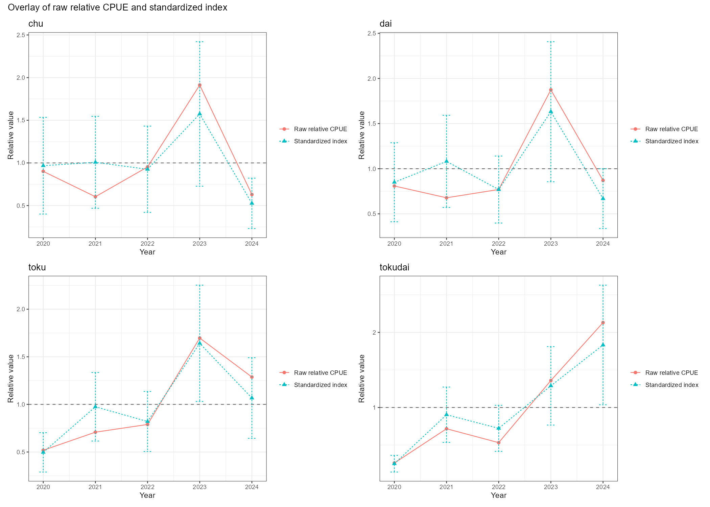

# AkagaiGLMM

## 概要

このリポジトリは、渡波漁船組合のアカガイ操業日誌データに基づいて、CPUE（単位努力量あたり漁獲量）の標準化および可視化を行うための解析ワークフローをまとめたものです。

このリポジトリに含まれるスクリプトは、以下の目的で使用されます：

* 操業日誌の生データのチェック
* 解析のためのデータのクリーニングおよび再構造化
* CPUE標準化のためのGLMM（一般化線形混合モデル）の当てはめ
* 候補モデルの比較
* 解釈および報告のための表および図の出力

本リポジトリは、公開を前提として整備された研究用コードです。主な想定読者は共同研究者ですが、外部の閲覧者にも理解できるよう、構造および出力内容についても説明を記載しています。

---

## 解析フロー

以下の順序で、スクリプトを1本ずつ手動で実行してください：

`01_check_raw_data.R` → `02_make_clean_data_and_figures.R` → `03_fit_glmm_models.R`

各ステップの内容：

* `R/01_check_raw_data.R`
  `ActualData/Akagai_sheet.xlsx` を読み込み、生データの値をチェックし、チェック用の表および図を `output/` に出力します

* `R/02_make_clean_data_and_figures.R`
  チェック結果を読み込み、解析用の整形済みデータセットを作成し、追加の集計表および図を出力します

* `R/03_fit_glmm_models.R`
  `data_processed/akagai_glmm_input.csv` を読み込み、候補となるGLMMを当てはめ、AICによってモデル比較を行い、標準化指数および比較図を出力します

Rでの実行例：

```r
source(file.path("R", "01_check_raw_data.R"))
source(file.path("R", "02_make_clean_data_and_figures.R"))
source(file.path("R", "03_fit_glmm_models.R"))
```

---

## 必要なデータ（Required data）

このワークフローを実行するためには、以下の入力ファイルを手動で配置する必要があります：

* `ActualData/Akagai_sheet.xlsx`

実データは、この公開リポジトリには含まれていません。

入力ファイルの形式を確認するための参考として、以下のダミーファイルを同梱しています：

* `ActualData/example_Akagai_sheet.xlsx`

また、既存スクリプトで使用される補助ファイルとして、以下も含まれています：

* `ActualData/AreaLonLat.csv`

`ActualData/` ディレクトリ自体はリポジトリに含まれていますが、実データである `ActualData/Akagai_sheet.xlsx` はバージョン管理から除外されています。

---

## 実行方法

1. 実データファイルを `ActualData/Akagai_sheet.xlsx` として配置します
2. R または RStudio でプロジェクトを開きます
3. 3つのスクリプトを順番に手動で実行します
4. 必要に応じて、`output/` 内の中間ファイルや `data_processed/` 内の整形済みデータを確認します
5. 公開用には、ローカルで生成された結果の中から、必要な図や表を `docs/results/` にコピーします

本リポジトリは、単一コマンドで一括実行するパイプラインではなく、ステップごとに手動で実行することを前提として設計されています。

---

## 主な結果

公開用リポジトリにおいて、主に参照すべき成果物は以下の2つです：

* `docs/results/aic_compare_all.csv`
* `docs/results/overlay_best_combined_2x2.png`

`aic_compare_all.csv` は、各応答変数に対する候補モデルの比較結果をまとめた統合テーブルです。AICおよびΔAICなどの適合度指標を含み、各応答に対して共通の比較データセット上でモデル選択がどのように行われたかを示します。

`overlay_best_combined_2x2.png` は、4つのサイズ区分（`chu`, `dai`, `toku`, `tokudai`）に対する主要な要約図です。選択されたGLMMによる標準化指数と、生の相対CPUEを重ねて表示しており、モデルによる標準化後の傾向と未標準化の年変動がどの程度一致しているか、あるいは乖離しているかを視覚的に確認できます。

`docs/results/overlay_best_combined_2x2.png` がリポジトリ内に存在する場合、以下のように埋め込むことができます：



解釈は慎重に行う必要があります。
一般的に、標準化指数は、漁区・船・月・努力量、さらに選択された場合には水深構造などの影響を補正した上で、年ごとの変動を評価するために有用です。一方、生のCPUEは未標準化の指標であり、漁獲率の変化だけでなく、サンプリング構成の変化の影響も受けます。したがって、両者の違いは、生物学的な変化だけでなく、共変量構造の影響を示唆している可能性があります。

---

## 重要な注意点

* 深度欠損の扱い
  深度が欠損または利用不可能なレコードは、可能な限り前処理段階では保持されますが、両方の深度列が欠損している場合や、両方の深度がクリーニングで設定された閾値を超える場合には、`depth_glmm` は `NA` とされます。そのため、深度を含むモデル比較は、深度情報が利用可能な行に基づいて行われます。

* 速度および曳航時間の置換ルール
  `R/02_make_clean_data_and_figures.R` において、速度は欠損、`<= 0.5`、または `> 5` の場合に `3` ノットに置換されます。曳航時間は欠損、`<= 10` 分、または `> 90` 分の場合に `60` 分に置換されます。

* 標準化CPUE指数
  標準化指数はモデルから導出された相対指標であり、絶対的な資源量やバイオマスを直接示すものではありません。

* モデル比較のデータセット
  各応答変数ごとに、候補モデルは同一のサブセット上で比較されています。これにより、AICの差がデータの違いではなく、モデル構造の違いを反映するようにしています。

---

## 出力

ローカル環境で解析を実行した場合、スクリプトは主に以下のディレクトリに中間および最終出力を保存します：

* `output/`
* `data_processed/`

これらのディレクトリはローカル実行によって生成される成果物を含むため、バージョン管理からは除外されています。

公開用リポジトリでは、まず以下のディレクトリに整理された成果物を参照してください：

* `docs/results/`

公開用として推奨されるファイルには、以下が含まれます：

* `docs/results/aic_compare_all.csv`
* `docs/results/overlay_best_combined_2x2.png`

`best_model_table.csv` や `best_model_summary.csv` などのファイルも有用です。
